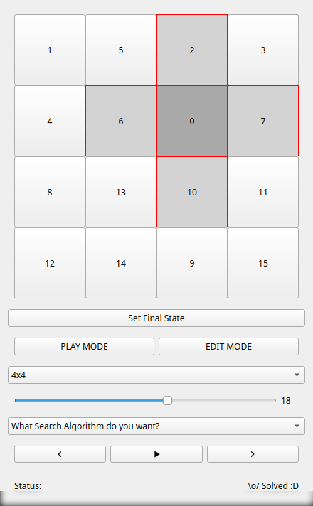
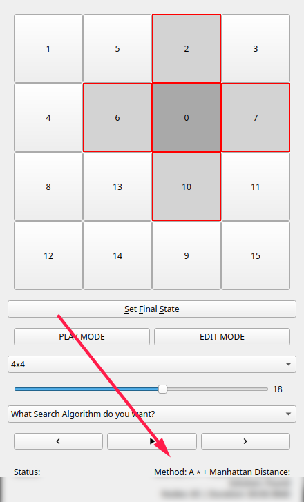
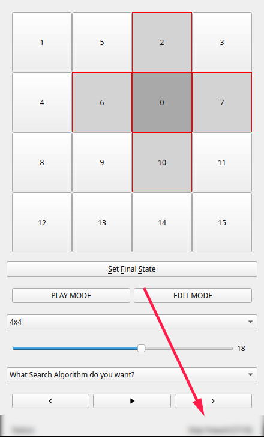
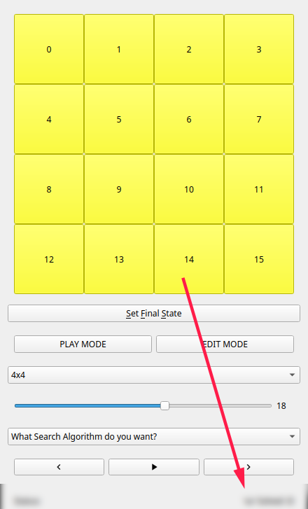
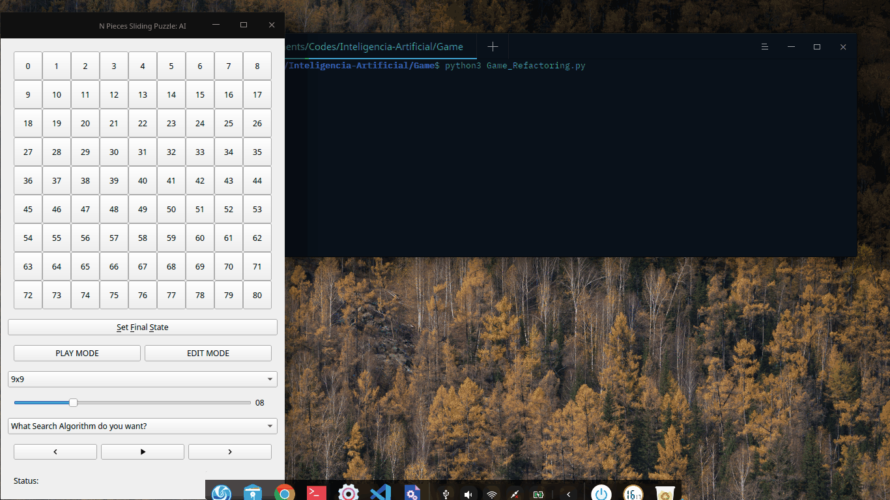

# Inteligência Artificial

Demonstração dos diversos algoritmos de busca através do jogo Sliding Puzzle.
Nesta aplicação foi utilizado o **PyQt5** para fazer a interface gráfica. As impletações dos algoritmos estão na pasta "./Core" a interface está na pasta "./Game".

| WARNING: Alguns métodos podem causar travamentos, pois utilizam recursividade e cada iteração consome memória para guardas os estados do tabuleiro.|
|---|

#### Interface

|

|

### Modos de jogo
O jogo possui dois modos: "PLAY MODE" e "EDIT MODE". O primeiro significa que você pode mover as peças segundo as regras originais do jogo, isto é, para uma posição adjacente a peça que contém "0". Já o último, é possível mudar uma peça para qualquer posição desejada. A diferença entre os dois modos é que o primeiro tem uma grande probabilidade de haver solução (Eu não garanto pois não realizei nem uma pesquisa na litetura a respeito disso).

### Cuidado
Há um mecanismo de "segurança" que limita os algoritmos até uma profundidade máxima, porém não confie nele pois até a uma baixa profundidade pode haver muitos estados. Considere que todo o movimento gere 4 novos possiveis movimentos e que a solução mais "rasa" está a 21 movimentos. Então o número de estados até lá será de 4 ^ 21 = 4,398,046,511,104. Que são muitos estados para se armazenar na memória.

### Demonstração
> Onde ficou marrom é amarelo, o algoritmo de compactação de imagens cria essas distorções.

